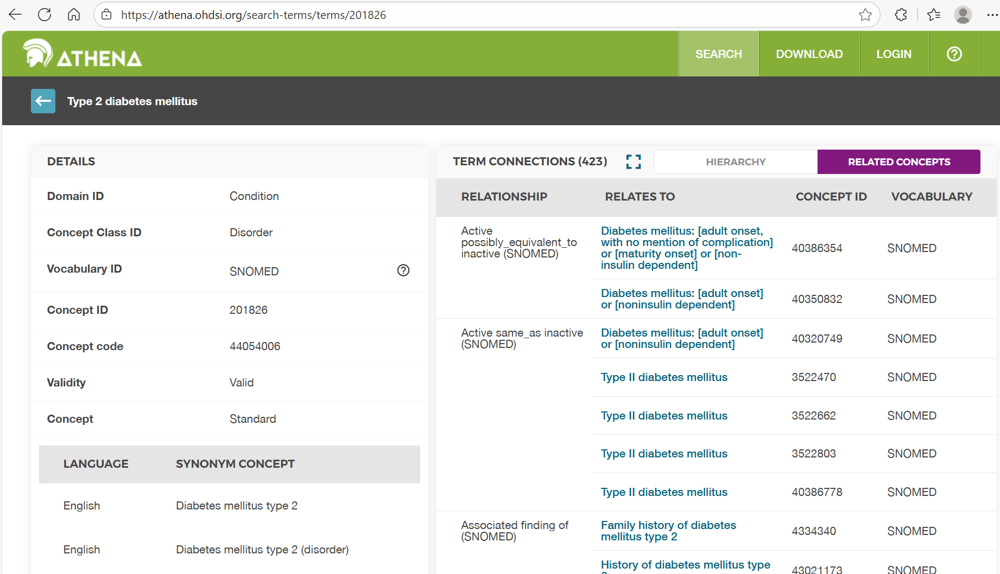
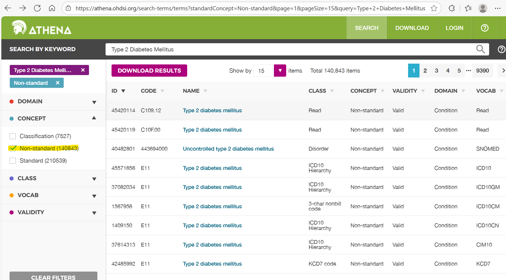

---
## 🧭 Athena Vocabulary Exploration Exercise

This exercise focuses exclusively on exploring the **OMOP Standardized Vocabularies** using [Athena](https://athena.ohdsi.org/).  
You’ll investigate how OMOP organizes concepts, relationships, and hierarchies — using *Type 2 Diabetes Mellitus* as an example condition.

---

### 💡 Learning Goals
By the end of this exercise, participants will be able to:

- Navigate **Athena** and locate clinical concepts across vocabularies.  
- Distinguish between **standard** and **non-standard** concepts.  
- Interpret concept **relationships** (“Maps to,” “Is a,” “Has ancestor,” etc.).  
- Recognize the structure and purpose of **OMOP vocabularies** and **domains**.  
- Understand how vocabulary choice impacts analytic consistency and data quality.

---

### 🔍 Section 1 – Getting Started with Athena

#### Step 1.1 — Search for a Clinical Condition
1. Open [Athena](https://athena.ohdsi.org/).  
2. Search for **“Type 2 Diabetes Mellitus.”**  
3. Identify:
   - The **standard concept** (`Standard Concept = S`)  
   - A related **non-standard concept** (`Standard Concept = NULL`)  
   - The **domain**, **vocabulary**, and **concept class**

**Trainer Prompts**
- What distinguishes “standard” vs “non-standard” in OMOP?  
- Which vocabularies are most common for *Condition* domains?  
- Why are “mapping” relationships essential for standardization?

---

#### Step 1.2 — Review Concept Details and Hierarchies
1. Open the **Concept Details** page for your chosen concept.  
2. Explore relationships, ancestors / descendants, and concept class.

**Trainer Prompts**
- How do “Is a” and “Has ancestor” define hierarchy?  
- Why might “Maps to” differ from “Is a”?  
- When reviewing descendants, how do you decide what’s “too specific”?

---

### 🧭 Section 2 – Vocabulary Interpretation and Mapping Logic

#### Step 2.1 — Explore Relationships
Choose a **non-standard ICD10CM** code for Type 2 Diabetes and inspect its mappings.

**Questions**
1. What happens if two ICD codes map to the same SNOMED concept?  
2. How does that improve cross-institution consistency?  
3. What does “Maps to value” mean?

---

#### Step 2.2 — Vocabulary Hierarchy Practice
Pick another condition (e.g., *Hypertension*, *Asthma*, *Heart Failure*).

- Count how many **descendants** the top-level concept has.  
- Identify one or two that might be **too specific**.  
- Review the **vocabulary version** and note updates.

**Trainer Prompts**
- How frequently are vocabularies updated in Athena?  
- What are the risks of using outdated vocabularies?  
- How can version metadata be stored for reproducibility?

---

### 🧪 Section 3 – Reflection and Data Quality Awareness

**Reflection Questions**
- How does using standardized vocabularies improve analytic reproducibility?  
- What mapping errors could affect cohort counts?  
- Why can’t non-standard codes be used directly?  
- How does vocabulary hierarchy influence inclusion/exclusion?

**Trainer Extension**
- Explore a multi-domain concept like “HbA1c.”  
  - Compare Measurement vs Observation domains.  
  - Why does domain assignment matter for analytics?

---

### 📋 Deliverables
- Completed answers to vocabulary questions.  
- 2–3 screenshots from Athena (search, details, relationships).  
- Reflection notes summarizing insights.

---

### 🧾 Trainer Overview (Sample Discussion Notes)
**Example:**  
- *Standard concept:* `Type 2 diabetes mellitus` (SNOMED 201826).  
- *Non-standard concept:* `E11.9 – Type 2 diabetes mellitus without complications` (ICD10CM) → maps to 201826.  
- OMOP standardizes to SNOMED so EHR diagnoses share a common meaning.  
- ICD codes map to SNOMED via “Maps to” relationships in Athena.

Back to the module: [Day 1 · OMOP CDM](../modules/day-01-omop-cdm.md)
