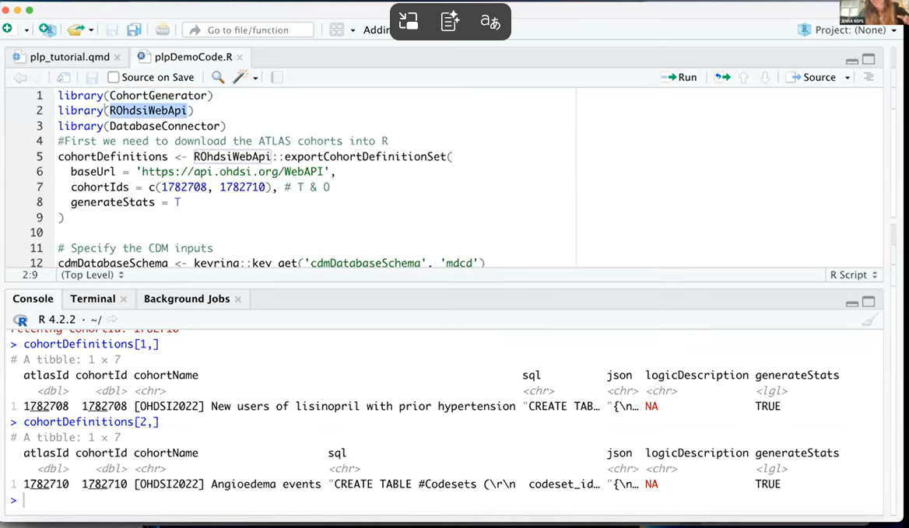
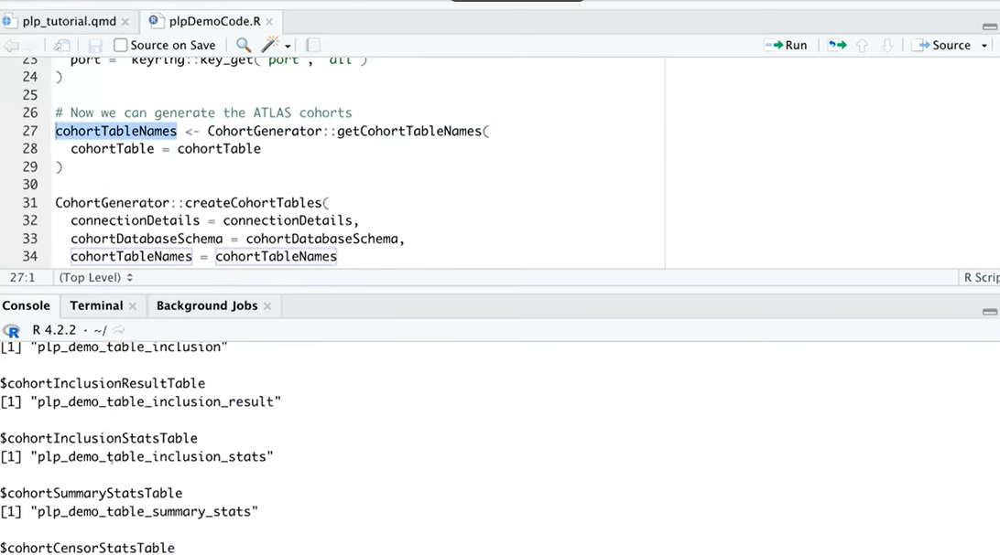
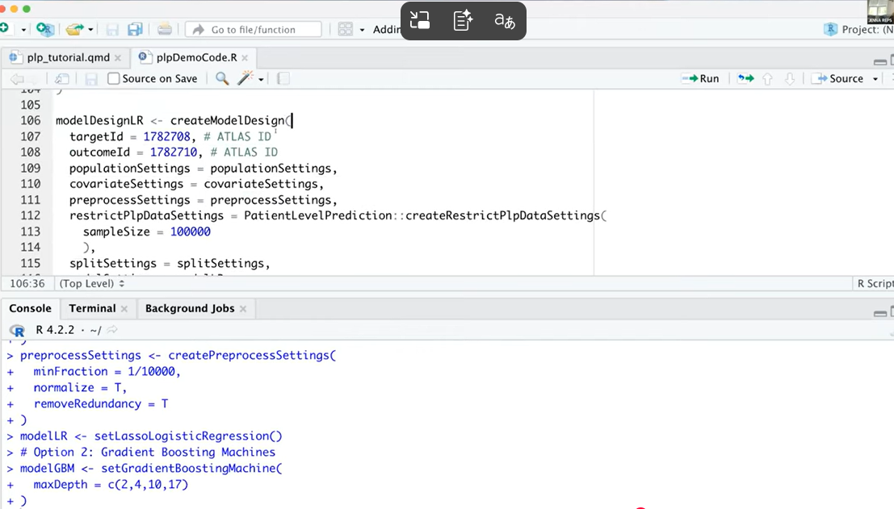
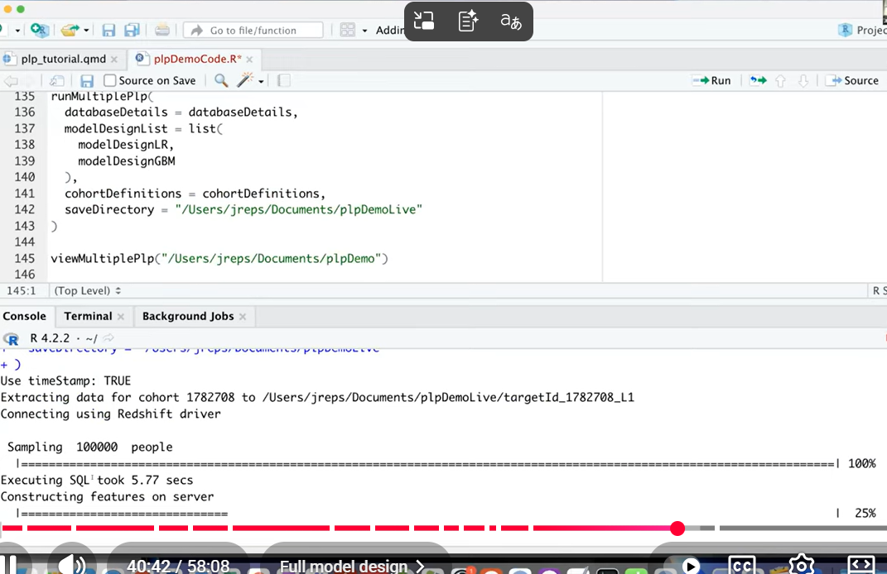
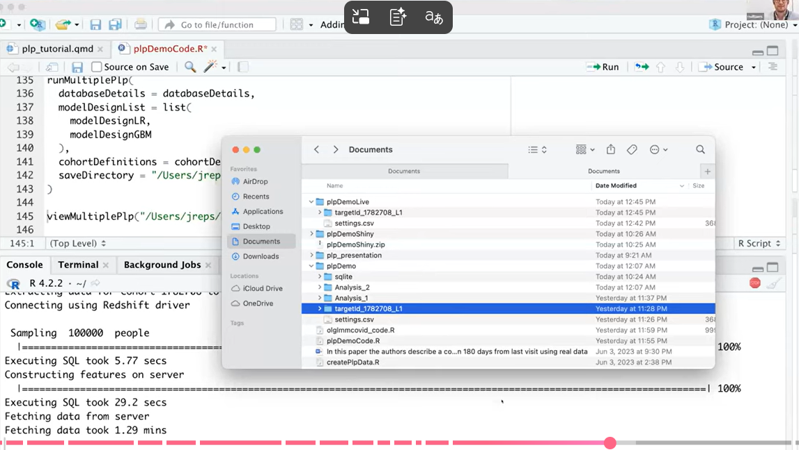
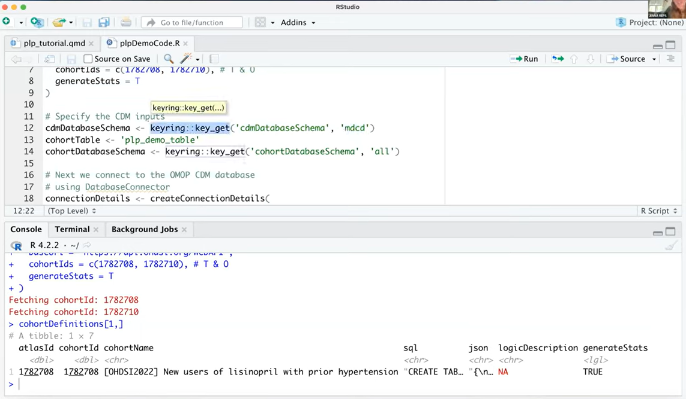

# Reading Your Results

<ul class="meta-row">
  <li><strong>Type</strong> interpretation guide</li>
  <li><strong>Time</strong> ~20 min</li>
  <li><strong>Tool</strong> OHDSI Analysis Viewer (Shiny)</li>
</ul>

Running the model is the easy part. This page is about the harder part: telling a
good model from a flattering one, and communicating either honestly.

The OHDSI Analysis Viewer is an interactive Shiny application for exploring
`PatientLevelPrediction` results. It is where model evaluation and interpretation
happen &mdash; and where most of the plots you would otherwise struggle to build
yourself appear for free.

<div class="handoff">
  <div class="handoff__side handoff__side--design">
    <h4>Before</h4>
    <ul>
      <li>ATLAS &mdash; cohort and population definition</li>
      <li>PatientLevelPrediction &mdash; training and validation</li>
    </ul>
  </div>
  <div class="handoff__pipe">
    <span class="label">produces</span>
    <span class="cohort-id">results/</span>
    <span class="label">on disk</span>
  </div>
  <div class="handoff__side handoff__side--exec">
    <h4>Now</h4>
    <ul>
      <li>Analysis Viewer &mdash; exploration</li>
      <li>Reporting and sharing</li>
    </ul>
  </div>
</div>

---

## What you need before launching

- A **completed PLP run**.
- Results **saved to disk** &mdash; `savePlpResult = TRUE`, or a `saveDirectory`
  passed to `runPlp()` / `runMultiplePlp()`.
- A results directory containing performance, covariate, and model objects.

```r
library(PatientLevelPrediction)

viewPlp(runPlp = lrResults)            # a single run, in memory
viewMultiplePlp("~/plpDemoLive")       # a directory of runs
```

!!! info "Package naming"

    The viewer has shipped under more than one name and has been split out of
    `PatientLevelPrediction` at points in its history. If `viewPlp()` is not
    found, check whether your installation expects a separate viewer package,
    and consult the
    [PatientLevelPrediction documentation](https://ohdsi.github.io/PatientLevelPrediction/)
    for the current entry point.

---

## Read the tabs in this order

Not the order they appear in. This order.

### 1. Summary — sanity check first

<figure markdown="1">

<figcaption><b>One row per target&ndash;outcome&ndash;model&ndash;database
combination.</b> Before reading any performance number, check that the row
describes the study you meant to run: right cohorts, right time at risk, right
population size.</figcaption>
</figure>

Ask, in order:

1. **Is the population size plausible?** A cohort that should have 40,000 people
   and has 400 means your inclusion logic or your `sampleSize` is not what you
   thought.
2. **Is the outcome count adequate?** A handful of events cannot support a
   high-dimensional model regardless of what the AUROC says.
3. **Is the time at risk what the protocol specified?**

If any of those is wrong, stop. Nothing downstream is interpretable.

### 2. Discrimination — can it separate people at all?

<figure markdown="1">

<figcaption><b>The ROC curve and its companions.</b> Hover any point to read the
threshold with its sensitivity and specificity. Precision&ndash;recall matters
more than ROC when the outcome is rare.</figcaption>
</figure>

| Metric | Reads as | Watch for |
|---|---|---|
| **AUROC** | Probability the model ranks a random person with the outcome above a random person without | Insensitive to class imbalance &mdash; looks fine even when the model is useless at the operating point you care about |
| **AUPRC** | Precision across the recall range | The honest metric for rare outcomes. A model with AUROC 0.80 can have AUPRC near the base rate |

!!! warning "Calibrate your expectations for what is good"

    For most clinically meaningful prediction problems in observational health
    data, AUROC lands somewhere in the 0.65&ndash;0.80 range. Above 0.90, your
    first hypothesis should be leakage, not brilliance &mdash; see the
    [leakage trap](day-06-plp-walkthrough.md#the-prediction-problem).

### 3. Calibration — are the probabilities real?

<figure markdown="1">

<figcaption><b>Predicted risk against observed risk.</b> A well-calibrated model
sits on the diagonal: when it says 10%, roughly 10% of those people have the
outcome. Demographic calibration shows whether that holds within
subgroups.</figcaption>
</figure>

Discrimination and calibration are different properties, and a model can have one
without the other. A model that ranks people perfectly but systematically
predicts 3× the true risk will rank correctly and mislead anyone who reads the
number.

**Calibration is the property that matters at the bedside**, because clinicians
act on absolute risk, not on rank.

- **Slope near 1, intercept near 0** &mdash; well calibrated.
- **Poor calibration** &mdash; consider recalibration, and be explicit that you
  did.
- **Good overall calibration, poor within a subgroup** &mdash; report it. This is
  how prediction models cause harm quietly.

### 4. Model — does it make clinical sense?

<figure markdown="1">

<figcaption><b>The face-validity check.</b> The covariates in the model and how
much each contributes. You are looking for both "yes, of course" and "why on
earth is that in there?"</figcaption>
</figure>

This is where domain expertise earns its keep, and where a clinician collaborator
is worth more than another algorithm. Two things to look for:

- **Expected predictors present.** For AF-to-stroke: age, prior stroke, heart
  failure, hypertension, diabetes. If none of the CHA₂DS₂-VASc components appear,
  something is wrong.
- **Suspicious predictors.** A covariate that is really a proxy for the outcome
  being recorded &mdash; an imaging procedure, a specialist referral, a
  medication started *because* the event happened. That is leakage wearing a
  disguise.

### 5. Predictions — where do people actually land?

<figure markdown="1">

<figcaption><b>Risk distributions for people with and without the outcome.</b> If
the two curves sit on top of each other, the model is not separating anyone
regardless of what the AUROC says.</figcaption>
</figure>

### 6. Threshold performance — the operating point

<figure markdown="1">

<figcaption><b>Pick a cut-off and read the consequences.</b> Sensitivity,
specificity, PPV, and NPV at that threshold &mdash; and how many people fall
either side of it.</figcaption>
</figure>

A model does not become a decision until someone picks a threshold, and that
choice is a clinical and ethical one, not a statistical one. How many false
positives is one true positive worth, in this setting, for this intervention?
Say it out loud, in the protocol, before you see the numbers.

---

## Reporting

The Shiny app can generate an HTML document &mdash; a report or protocol
&mdash; containing all of the study results. This matters more than it sounds:
it means the artifact you circulate for review is generated from the results
rather than transcribed from them, which removes an entire category of error.

---

## Common pitfalls

<div class="grid cards" markdown="1">

-   :material-folder-alert: **Viewer opens empty**

    ---

    Almost always the wrong directory, or results that were never written to
    disk. Confirm `savePlpResult = TRUE` or that `saveDirectory` was set, and
    point the viewer at the folder containing the run, not its parent.

-   :material-trending-up: **AUROC looks too good**

    ---

    Suspect leakage first. Check that covariates end at `endDays = -1`, then
    read the model tab for covariates that are really outcome markers. Then
    validate externally.

-   :material-chart-bell-curve: **Poorly calibrated**

    ---

    Common when the model is applied to a population with a different base rate
    than it was trained on. Consider recalibration &mdash; and report that you
    recalibrated, along with the method.

-   :material-database-search: **Great internally, poor externally**

    ---

    This is information, not failure. It tells you the model encoded something
    specific to the development database &mdash; coding practice, care pathway,
    population mix. Report it; it is one of the more useful things a prediction
    study can find.

</div>

### External validation

Internal validation tells you the model is not overfit to its training rows.
**External validation tells you whether it transfers** &mdash; and in
observational health data, the answer is often no, for reasons worth
understanding.

```r
plpModel <- loadPlpModel(file.path(tempdir(), "model"), "model")

validationDatabaseDetails <- createDatabaseDetails()   # the new database

externalValidateDbPlp(
  plpModel                          = plpModel,
  validationDatabaseDetails         = validationDatabaseDetails,
  validationRestrictPlpDataSettings = plpModel$settings$plpDataSettings,
  settings = createValidationSettings(
    recalibrate = "weakRecalibration"
  ),
  outputFolder = file.path(tempdir(), "validation")
)
```

!!! tip "Do not skip this because the result might be disappointing"

    A model that validates poorly and says so is a contribution. A model that was
    never externally validated and gets deployed is a liability. TRIPOD reporting
    guidance exists for exactly this reason.

---

## Self-check

<div class="quiz">
  <p class="quiz__q">A model has AUROC 0.78 and a calibration slope of 0.45. What does that combination mean?</p>
  <ul class="quiz__opts">
    <li data-correct="false">The model is broken and should be discarded</li>
    <li data-correct="true">It ranks people reasonably well, but its predicted probabilities are too extreme to be used as absolute risks</li>
    <li data-correct="false">The AUROC must be wrong, since calibration is poor</li>
    <li data-correct="false">The outcome is too rare for the model to work</li>
  </ul>
  <div class="quiz__why">
    <p>Discrimination and calibration are independent properties. A slope well
    below 1 means predictions are spread too wide &mdash; high risks
    overestimated, low risks underestimated &mdash; which is a classic sign of
    overfitting or of applying a model to a population with a different base
    rate.</p>
    <p>The model may still be usable for <em>ranking</em> (who to review first),
    but not for telling a person their absolute risk, unless you recalibrate and
    say so.</p>
  </div>
</div>

---

## Continue

- :material-clipboard-check: [Lab & quiz](../exercises/day-06-hades-optional.md)
- :material-file-document-outline: [Prediction study protocol template](../common_artifacts/plp-study-protocol-template.md)
- :material-arrow-left: [Back to the Week 6 module](day-06-hades.md)
