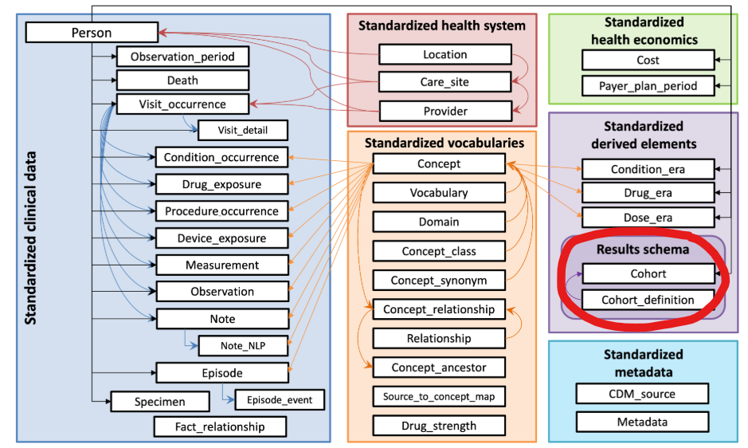
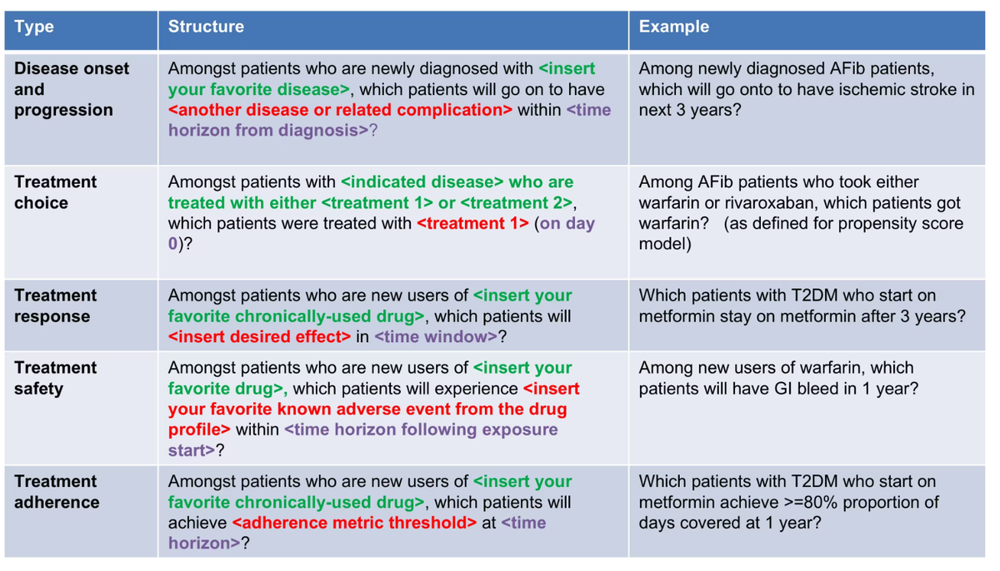
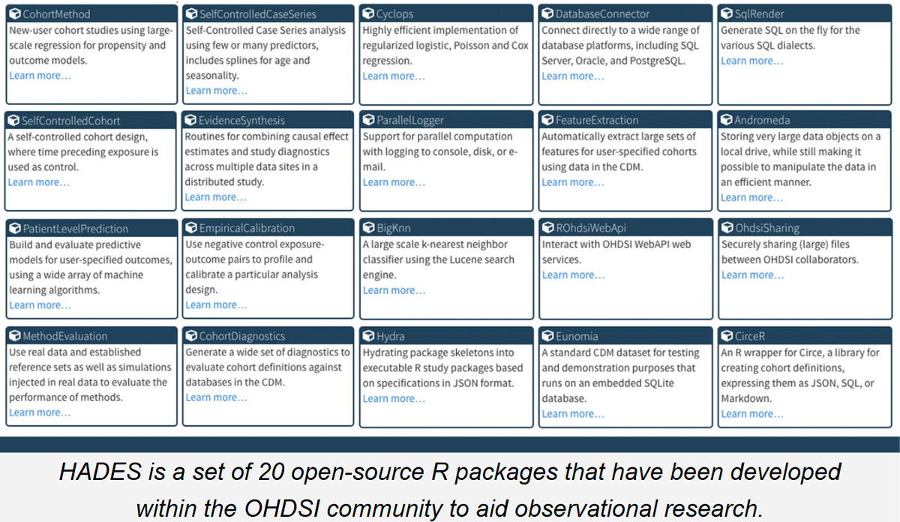

# Week 6 · From ATLAS to HADES

<ul class="meta-row">
  <li><strong>Format</strong> half day</li>
  <li><strong>Level</strong> optional / advanced</li>
  <li><strong>Prereqs</strong> Weeks 1&ndash;4</li>
  <li><strong>Tools</strong> ATLAS · R</li>
</ul>

Everything you have built so far &mdash; concept sets, cohort definitions,
generated cohorts &mdash; has been *specification*. This week is about
*execution*: taking those specifications into R and running real analytics
against the same CDM.

The single idea to hold on to: **nothing you learned in ATLAS is thrown away.**

<div class="handoff">
  <div class="handoff__side handoff__side--design">
    <h4>ATLAS · design</h4>
    <ul>
      <li>Concept sets</li>
      <li>Cohort entry &amp; exit criteria</li>
      <li>Inclusion rules</li>
      <li>Generate against the CDM</li>
    </ul>
  </div>
  <div class="handoff__pipe">
    <span class="label">hands off</span>
    <span class="cohort-id">#1769447</span>
    <span class="label">cohort ID</span>
  </div>
  <div class="handoff__side handoff__side--exec">
    <h4>HADES · execution</h4>
    <ul>
      <li>Covariate settings</li>
      <li>Model specification</li>
      <li>Diagnostics &amp; calibration</li>
      <li>File-based results</li>
    </ul>
  </div>
</div>

An integer is the whole handshake. A cohort you designed in a browser becomes a
number, and R picks it up from there.

---

## Learning objectives

By the end of this session you should be able to:

- explain the relationship between ATLAS and HADES to someone who thinks they
  are competitors;
- describe the three families of OHDSI analytic questions and say which one your
  own research question belongs to;
- identify the core HADES packages and what problem each one solves;
- trace a cohort from an ATLAS definition through a cohort ID into an R analysis;
- and run a small HADES workflow end to end, reporting its diagnostics.

## Session plan

| Time | Session |
|---|---|
| 9:30 &ndash; 10:00 | Kahoot! and review |
| 10:00 &ndash; 10:30 | The OHDSI mindset |
| 10:30 &ndash; 11:30 | Beyond ATLAS: HADES and the analytics ecosystem |
| 11:30 &ndash; 11:45 | Break |
| 11:45 &ndash; 12:30 | [Patient-level prediction: hands-on](day-06-plp-walkthrough.md) |
| 12:30 &ndash; 1:00 | Concluding thoughts and staying connected |

!!! abstract "Materials"

    - :material-file-download: [Week 6 slide deck (PDF)](../assets/day6/DAY_6_HADES.pdf)
    - :material-clipboard-check: [Lab & quiz](../exercises/day-06-hades-optional.md)
    - :material-cards: [HADES package catalogue](day-06-hades-packages.md)
    - :material-swap-horizontal: [ATLAS to HADES hand-off sheet](../common_artifacts/atlas-to-hades-handoff.md)

!!! note "Housekeeping — local naming"

    Terminology in this room does not always match the documentation:

    | When the slides say | In our environment that is |
    |---|---|
    | ATLAS | SEARCH |
    | Cohort definition | Criteria definition |
    | OHDSI Methods Library | HADES (the current name) |

    Reference for the data model: [OMOP CDM v5.4](https://ohdsi.github.io/CommonDataModel/cdm54.html).

---

## The OHDSI mindset

### Quick review: the Common Data Model

<figure markdown="1">

<figcaption><b>You have already used the circled tables.</b> Most of this course
has lived in the blue clinical tables and the orange vocabularies, with a few
visits to <code>drug_era</code>. But every time ATLAS generated a cohort, it wrote
to <code>cohort</code> and <code>cohort_definition</code> in the results schema
&mdash; probably without you noticing.</figcaption>
</figure>

The CDM gives you a shared relational structure and a shared vocabulary system.
That is what lets different tools, and different institutions, speak the same
analytic language.

### Where ATLAS fits

ATLAS is not a standalone application, and it is not a competitor to the R
packages. It is a **study specification tool** that sits directly on top of the
CDM.

- It queries the **same tables** &mdash; `PERSON`, `CONDITION_OCCURRENCE`,
  `DRUG_EXPOSURE`. There is no ATLAS-only data layer and no separate copy of the
  data.
- It uses the **same database connection**.
- What it produces is a **formal, reusable cohort definition**, independent of
  any particular analysis.

### Cohorts, generation, and IDs

When you generate a cohort, it is *materialized* in the database: rows land in
the standardized cohort tables, and the definition gets a unique
<span class="cohort-id">cohort_definition_id</span>.

That ID is the point. Analytic code does not re-specify your inclusion logic; it
references the ID. Which means:

- the same population definition is used consistently across every analysis;
- two studies that cite the same cohort ID are genuinely using the same cohort;
- and design decisions stay explicit and reviewable rather than buried in a
  script.

```r
# This is the entire handoff. The cohort logic lives in ATLAS;
# R just names the number.
targetId  <- 1782708   # newly diagnosed atrial fibrillation
outcomeId <- 1782710   # ischemic stroke
```

<div class="quiz">
  <p class="quiz__q">Your colleague says: "I'll rebuild the atrial fibrillation cohort in R so the analysis is self-contained." What is the strongest objection?</p>
  <ul class="quiz__opts">
    <li data-correct="false">R is too slow to build cohorts on a large CDM</li>
    <li data-correct="true">The two definitions will drift, and results will no longer be comparable to anything else that used the ATLAS cohort</li>
    <li data-correct="false">HADES packages cannot accept cohorts built outside ATLAS</li>
    <li data-correct="false">Cohort tables are read-only</li>
  </ul>
  <div class="quiz__why">
    <p>Self-containment sounds like a virtue, and there <em>are</em> legitimate
    reasons to build cohorts in SQL &mdash; plenty of sites have an OMOP CDM but
    no ATLAS instance, and HADES will happily consume a cohort table populated
    any way you like. The problem is duplication: two hand-maintained
    definitions of "atrial fibrillation" will diverge the first time either one
    is edited, and then nobody can say whether a difference in results is a real
    finding or a definition change.</p>
    <p>If you do build in SQL, export the ATLAS SQL as your starting point rather
    than writing it fresh &mdash; see
    <a href="../day-06-plp-walkthrough/#option-b-build-the-cohorts-in-sql">the
    walk-through</a>.</p>
  </div>
</div>

### Design now, analyze later

The separation is deliberate:

| ATLAS | HADES |
|---|---|
| Interactive, in a browser | Scripted, in R |
| Specification: *who, when, what counts* | Execution: *fit, estimate, validate* |
| One database at a time | Runs offline and across sites |
| Reviewable by a clinician | Reproducible by a machine |

You design interactively, then run large or long analyses offline. HADES scales
past what a user interface can reasonably do &mdash; but it starts from what the
user interface produced.

---

## What kinds of questions does OHDSI support?

Before any method, there is a **question structure**. OHDSI's contribution here
is standardizing the *shape* of questions, not just the answers.

<div class="grid cards" markdown="1">

-   :material-account-search: **Clinical characterization**

    ---

    *Descriptive.* Who are these people and what happened to them?

    Disease natural history · treatment utilization · outcome incidence

    **Example:** among people with rheumatoid arthritis, what are their
    demographics, prior conditions, and medications?

-   :material-scale-balance: **Population-level effect estimation**

    ---

    *Causal.* Does this exposure change the risk of that outcome?

    Safety surveillance · comparative effectiveness

    **Example:** does exposure to an ACE inhibitor increase the risk of
    angioedema within one month of starting it?

-   :material-account-arrow-right: **Patient-level prediction**

    ---

    *Prognostic.* For this individual, what is likely to happen next?

    Disease onset and progression · treatment response · treatment safety

    **Example:** for someone newly diagnosed with atrial fibrillation, what is
    the probability of ischemic stroke in the next year?

</div>

Every one of those templates has the same replaceable parts: **a disease**, **an
exposure**, **an outcome**, **a time horizon**, and sometimes **a comparator**.
Those are exactly the things you already specified when you built cohorts in
Week 3 &mdash; who the people are, when follow-up starts, what counts as an
event.

<figure markdown="1">

<figcaption><b>The coloured slots are the point.</b> Disease, outcome, and time
horizon are parameters, not prose. Fill them in and you have specified a study
that someone else can inspect, reuse, and extend.</figcaption>
</figure>

!!! quote "This does not constrain what you can ask"

    Nothing here prevents novel questions. It asks you to express them in a form
    others can inspect and reuse. And you are not expected to work across all
    three families &mdash; the value is that the *same* cohort infrastructure
    supports whichever one you care about.

<div class="quiz">
  <p class="quiz__q">"Among people newly started on metformin, what proportion maintain HbA1c below 6.5% at three years?" &mdash; which family is this?</p>
  <ul class="quiz__opts">
    <li data-correct="false">Clinical characterization</li>
    <li data-correct="false">Population-level effect estimation</li>
    <li data-correct="true">Patient-level prediction — treatment response</li>
    <li data-correct="false">None of the above; it is a clinical trial question</li>
  </ul>
  <div class="quiz__why">
    <p>It is prognostic and about individuals, which makes it prediction rather
    than characterization. The tell is the absence of a comparator: nobody is
    asking whether metformin does this <em>better than</em> something else, which
    is what would make it effect estimation.</p>
    <p>Change the wording to "do people on metformin maintain HbA1c below 6.5%
    more often than people on a sulfonylurea?" and it becomes a comparative
    effectiveness question, with all the confounding-control machinery that
    implies.</p>
  </div>
</div>

---

## What HADES actually is

HADES &mdash; formerly the OHDSI Methods Library &mdash; is a set of
**open-source R packages designed to work together** across a full observational
study workflow. Studies start with data in the CDM and end with estimates,
figures, and tables.

<figure markdown="1">

<figcaption><b>Roughly twenty packages, each with a narrow job.</b> You will
never use all of them. The
<a href="day-06-hades-packages/">package catalogue</a> groups them by what you
are trying to do so you can find the three or four that matter for your
study.</figcaption>
</figure>

The packages talk to CDM data directly. You can use them as lightweight tools
for cross-platform compatibility, or as the backbone of a fully customized
analysis. They also ship standardized analytics for the three use-case families
above, with an emphasis on transparency, reproducibility, evaluating how a
method behaves in *your* context, and empirical calibration.

### HADES does not replace your knowledge

!!! danger "There is no button that does epidemiology for you"

    - You still need to **understand the method** you are choosing.
    - You still need to **specify the model** yourself.
    - You are still **writing R**.
    - There is no black box. The code is open, the settings are explicit, the
      diagnostics are generated by default, and the intermediate outputs are
      written to disk.

What HADES gives you is that, because the data are already in a CDM, the analysis
can be *pre-programmed*. You drop in your cohort IDs and concept IDs and build on
skeleton code that someone else has already debugged &mdash; which makes the work
transparent, reproducible, shareable inside your institution and across a
network, and consistent with FAIR principles and regulatory expectations for
auditing and code sharing.

### Skills worth shoring up first

Because so much of HADES is paint-by-numbers over well-tested skeletons, you do
not need to be an R expert. These specific things, though, make it much smoother:

<div class="grid cards" markdown="1">

-   **Specifying cohorts properly**

    ---

    Far and away the highest-leverage skill. A sloppy cohort produces a
    beautifully diagnosed, fully reproducible wrong answer.

-   **Relational databases and the CDM**

    ---

    Especially the cohort tables and what a `cohort_definition_id` is.

-   **R and GitHub basics**

    ---

    Enough to install packages from GitHub, read an error, and open an issue.

-   **How open source works**

    ---

    You can contribute, report bugs, and ask in the
    [forums](https://forums.ohdsi.org/). This is a normal part of using HADES,
    not an admission of defeat.

-   **Connecting to your CDM safely**

    ---

    Credentials in environment variables or a keyring &mdash; never in the
    script. See the
    [R environment checklist](../common_artifacts/hades-r-environment-checklist.md).

-   **The ATLAS ↔ R connection**

    ---

    Which is the whole point of this session.

</div>

### R concepts that pay off immediately

| Concept | Why it matters here |
|---|---|
| `renv` | Locks package versions so your study still runs next year, and on someone else's machine |
| Environment variables / `keyring` | Keeps database credentials out of scripts and out of Git |
| `DatabaseConnector` | One connection interface regardless of the SQL platform underneath |
| File-based outputs | Results are written to structured folders, not just printed &mdash; so they can be archived, reviewed, combined, and reused |
| GitHub | How you install packages, track versions, share code, and report problems |

!!! info "Why file-based results matter more than they sound like they should"

    In OHDSI, results do not just appear on screen. They are written to disk in a
    structured, human-*and*-machine-readable way. That is what makes them
    portable across sites, inspectable months later, and combinable into a
    network study &mdash; and it is what lets a Shiny viewer render a study
    someone else ran without you rerunning anything.

---

## OHDSI as collective experience at scale

A framing worth being explicit about, especially for a methodologically skeptical
room &mdash; and if you *are* skeptical, good; what kind of scientist would you
be otherwise?

OHDSI is not claiming to be the one correct way to do epidemiology, and it is not
proposing new methods by decree. It is a community that has spent years working
with large claims and EHR databases and has converged on practices that survive
at scale.

The design choices &mdash; file-based outputs, standardized cohorts, versioned
code, federated execution &mdash; did not come from theory. They came from people
repeatedly hitting the same walls:

- results that could not be reproduced;
- analyses that did not port to a new database;
- evidence that could not be combined across sites;
- and findings that could not be audited or revisited later.

Many of those people work in pharmacoepidemiology, with money and professional
reputation on the line and regulators watching. Those lessons are now encoded in
the tools rather than living in papers and institutional memory. And none of it
freezes the methods in place &mdash; the practices keep evolving through open
use, critique, the regulatory landscape, and new use cases.

A useful way to think about OHDSI: not "the right method," but *collective
experience made operational*, in code, structure, and shared expectations.

### OHDSI uses methods you already know

This addresses the reasonable version of the objection: *if I already trust the
tools I use in R, why should I trust these?*

Because underneath, they are the same mathematics.

- Most OHDSI analyses rest on **logistic regression, Cox proportional hazards,
  and Poisson models**. If you trust `glm()` and `coxph()`, you already trust the
  foundations.
- Prediction uses **established machine learning**, not novel architectures.
- The novelty is **infrastructure and workflow**, not new statistics.

Where OHDSI differs is in how those methods are operationalized: for very large
datasets, high-dimensional covariates, repeated execution across databases, and
auditable workflows.

!!! tip "On the 'black box' objection"

    OHDSI tools are opinionated, but they are not opaque &mdash; the code is
    open, model settings are explicit, diagnostics are produced by default, and
    intermediate outputs land on disk. You can inspect every step, often more
    easily than in a bespoke one-off analysis script.

    Worth noticing: people rarely ask how they know a proprietary statistical
    package is calibrated correctly, yet OHDSI is transparent about every tool in
    the stack.

<div class="quiz">
  <p class="quiz__q">A reviewer objects that your HADES-based study "used a non-standard method." What is the most accurate response?</p>
  <ul class="quiz__opts">
    <li data-correct="false">HADES has been validated by the FDA, so the method is approved</li>
    <li data-correct="true">Name the actual estimator — regularized Cox regression, say — and point to the open code and generated diagnostics</li>
    <li data-correct="false">Rerun the analysis in base R to confirm the result</li>
    <li data-correct="false">Explain that observational studies are held to a different standard</li>
  </ul>
  <div class="quiz__why">
    <p>The premise of the objection is usually wrong, and the fix is specificity.
    "Regularized Cox proportional hazards fit with Cyclops, with propensity score
    adjustment and negative-control calibration" is a standard method described
    precisely, and every setting is inspectable. Appeals to authority do not
    answer a methods question, and rerunning in base R concedes a premise that
    was never true.</p>
    <p>Where genuine scrutiny belongs is the <em>design</em>: your cohort
    definitions, time-at-risk, and confounding control. That is also where you
    should welcome it.</p>
  </div>
</div>

---

## Key takeaways

- **ATLAS defines the study design; HADES executes the analytics.** Different
  layers of one stack, not competing tools.
- **Cohort IDs are the interface.** Design once, reference everywhere.
- **Packages are modular and interoperable.** Learn the three or four you need.
- **The infrastructure is the innovation.** The statistics are ones you already
  know.

## Where to go next

<div class="grid cards" markdown="1">

-   :material-cards-outline: **[Package catalogue](day-06-hades-packages.md)**

    ---

    All twenty-odd packages, grouped by the job you are trying to do.

-   :material-play-box: **[Patient-level prediction walk-through](day-06-plp-walkthrough.md)**

    ---

    Two worked examples, end to end, in ATLAS and R.

-   :material-chart-line: **[Reading your results](day-06-analysis-viewer.md)**

    ---

    The Shiny viewer, and how to tell a good model from a flattering one.

-   :material-clipboard-check: **[Lab & quiz](../exercises/day-06-hades-optional.md)**

    ---

    Hands-on exercises with a progress tracker.

</div>

---

## Teaching notes

??? note "Pacing the room"

    Open with an anonymous poll &mdash; Kahoot with **Hide leaderboard** and **No
    points** turned on. Frame it explicitly: this is not a test, there are no
    right answers, answer based on how comfortable you feel *right now*. The
    spread you get back tells you where to spend the next three hours, and
    naming that spread out loud ("there is a wide range in this room, which is
    completely normal") lowers the temperature for the people at the bottom of
    it.

??? note "The one slide that has to land"

    The CDM diagram with `cohort` and `cohort_definition` circled. If people
    leave understanding that ATLAS wrote to those tables all along, the rest of
    the session is downhill. If they do not, the cohort-ID handoff stays magic.

??? note "Handling the skeptics"

    Do not defend OHDSI. Ask what they would need to see, then show them: the
    open source, the explicit model settings, the default diagnostics, the
    on-disk intermediates. Methodologists usually object to *opacity*, not to
    Cox regression &mdash; and OHDSI's answer to opacity is unusually strong.
    The section above is written to be read aloud almost verbatim if that helps.

??? note "Scope discipline"

    You cannot teach twenty packages in three hours and should not try. Name the
    landscape, then go deep on one worked example. Say out loud that you have not
    personally used all of these &mdash; it models the honesty you want from them
    when they teach it.

??? note "What always runs long"

    The package tour. Budget it hard, or move the whole catalogue to
    self-study and spend the recovered time on the
    [prediction walk-through](day-06-plp-walkthrough.md), which is what people
    remember.
