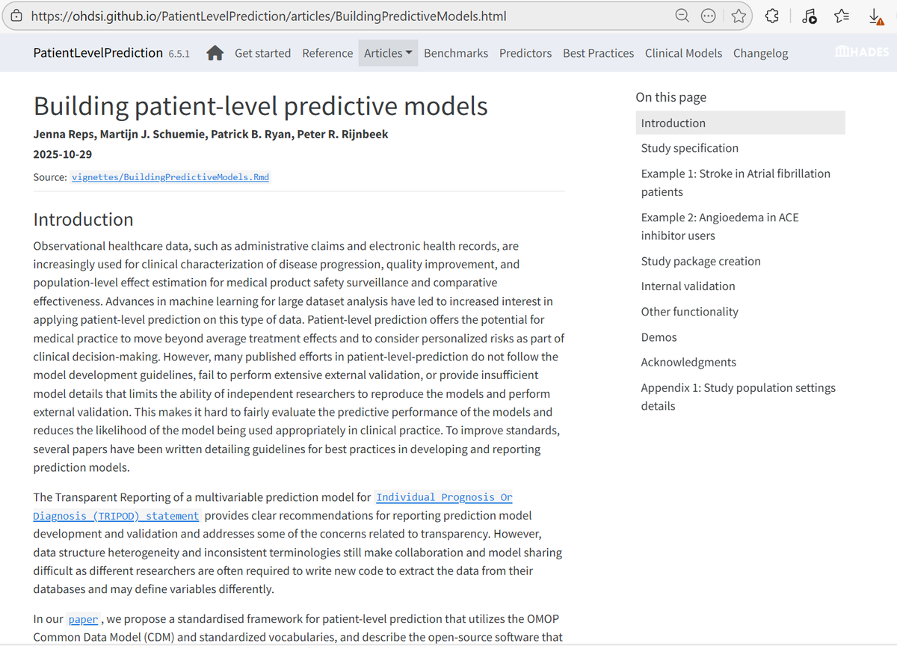
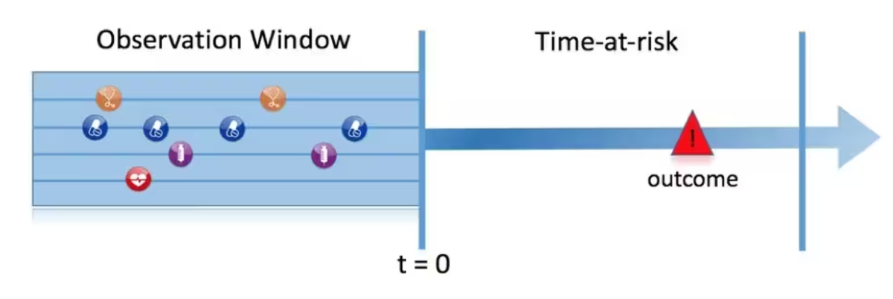
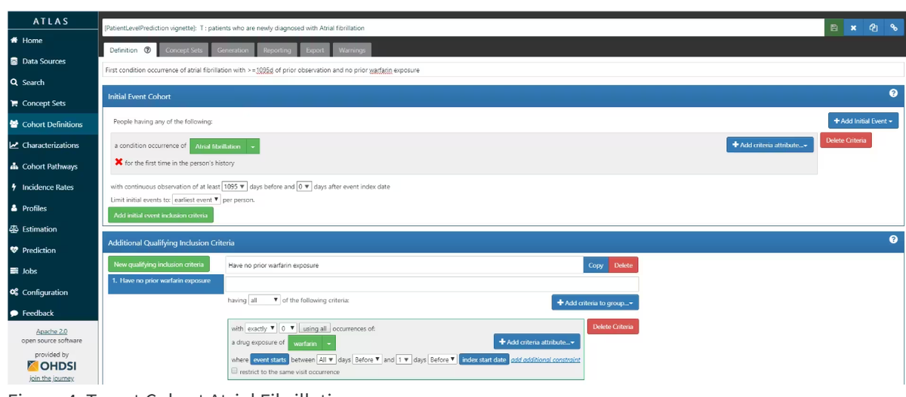
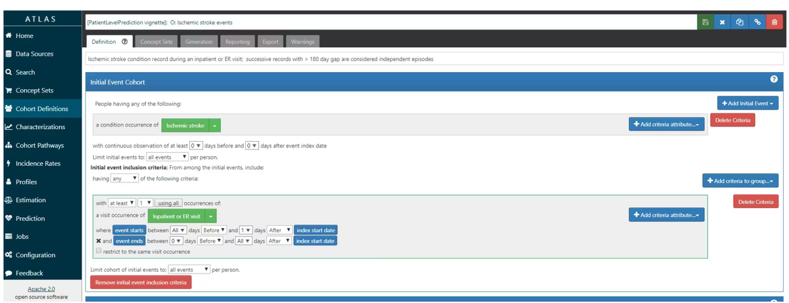
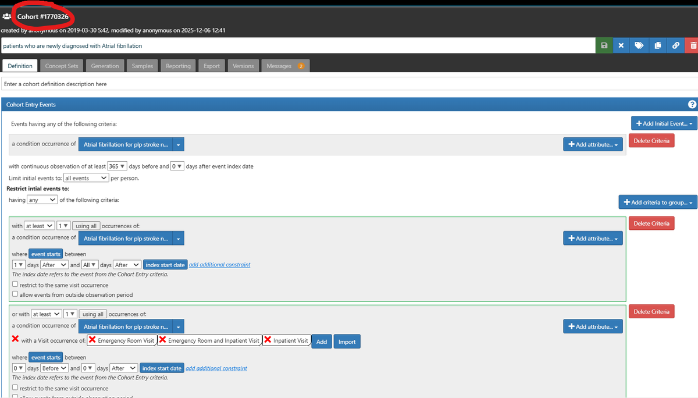
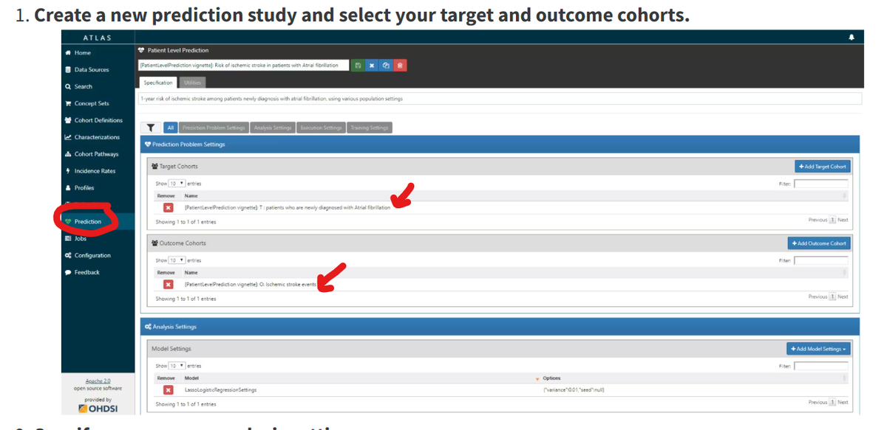
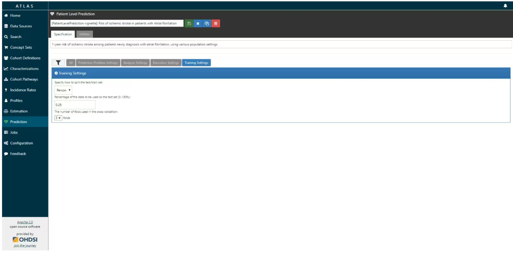
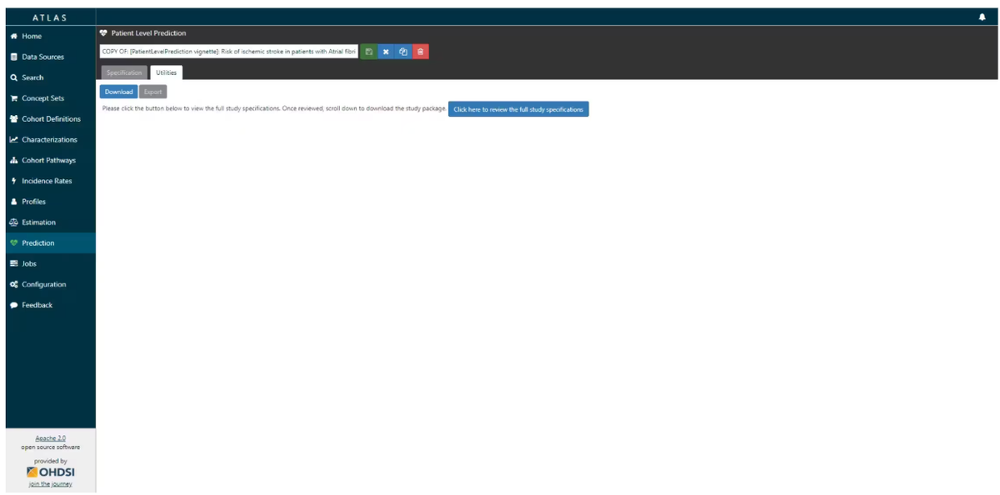
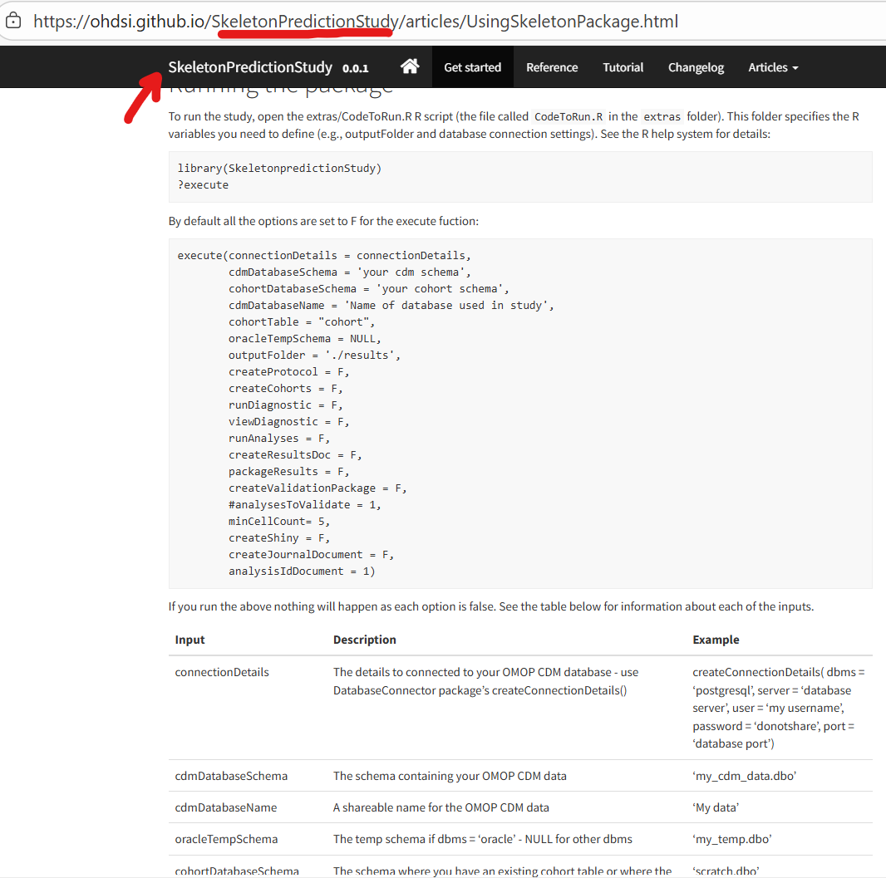
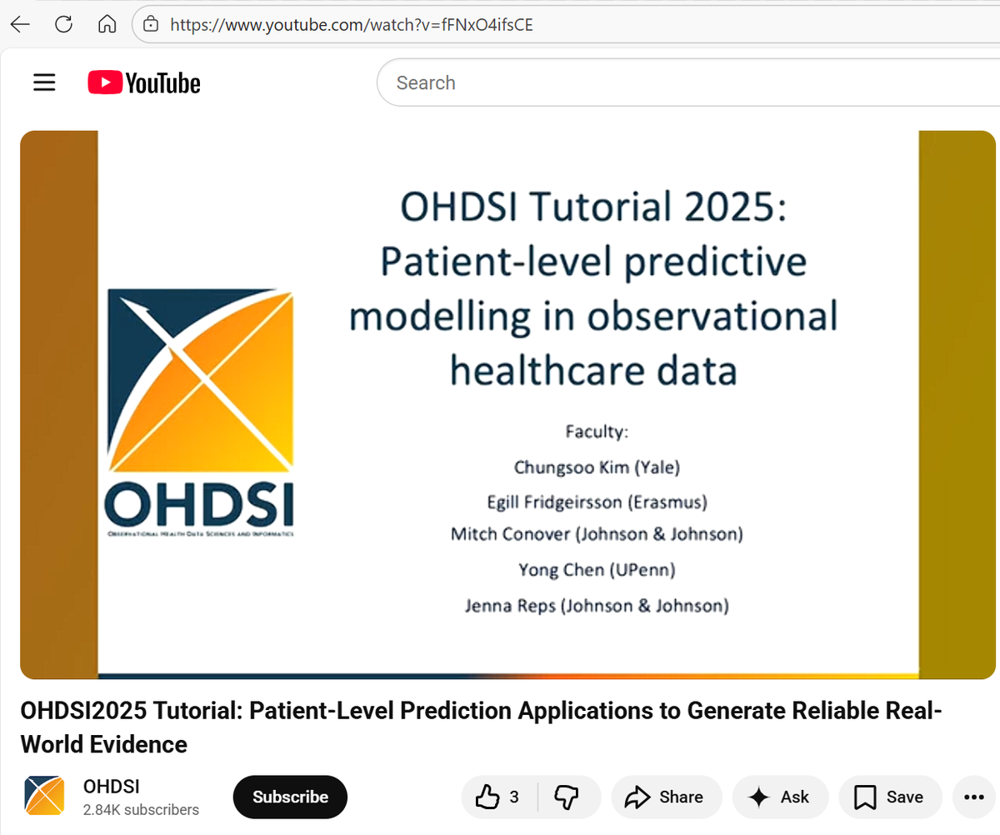

# Walk-through · Patient-Level Prediction

<ul class="meta-row">
  <li><strong>Format</strong> demo + follow along</li>
  <li><strong>Time</strong> ~45 min</li>
  <li><strong>Tools</strong> ATLAS · R</li>
  <li><strong>Data</strong> your CDM or Eunomia</li>
</ul>

This is the session where the hand-off stops being abstract. We take two cohorts
designed in ATLAS, hand their IDs to R, fit a model, and read the diagnostics.

!!! info "There is no shortage of documentation for this"

    Quite the opposite. Search for `PatientLevelPrediction` and you will find
    videos, repositories, posters, and papers. What follows is a taste of the
    shape of the work, not a substitute for the
    [package vignettes](https://ohdsi.github.io/PatientLevelPrediction/).

    The framework is described in Reps JM, Schuemie MJ, Suchard MA, Ryan PB,
    Rijnbeek PR. *Design and implementation of a standardized framework to
    generate and evaluate patient-level prediction models using observational
    healthcare data.* J Am Med Inform Assoc. 2018;25(8):969&ndash;975.

---

## The prediction problem

<figure markdown="1">

<figcaption><b>Among a population at risk, which people at a defined moment
(t&nbsp;=&nbsp;0) will experience the outcome during the time at risk?</b>
Prediction uses <em>only</em> information from the observation window before
t&nbsp;=&nbsp;0. Everything to the right of the index date is what you are
predicting, not what you predict with.</figcaption>
</figure>

To define a prediction problem you must define four things:

<div class="grid cards" markdown="1">

-   :material-target: **T &mdash; Target cohort**

    ---

    Who is at risk, and when their clock starts. This is t = 0.

-   :material-alert-circle: **O &mdash; Outcome cohort**

    ---

    What you are predicting. A cohort like any other.

-   :material-clock-outline: **TAR &mdash; Time at risk**

    ---

    The window in which the outcome counts. Starts relative to index, ends
    relative to index.

-   :material-tune: **Design choices**

    ---

    Covariates, lookback, algorithm, validation strategy, and which databases
    you will develop and validate on.

</div>

<figure markdown="1">

<figcaption>The same picture as a timeline. The gap between the end of the
covariate window and t&nbsp;=&nbsp;0 is deliberate &mdash; see the note on
leakage below.</figcaption>
</figure>

!!! danger "The leakage trap"

    If your covariate window runs *through* the index date, the event that
    defines cohort entry leaks in as a predictor. Your AUROC looks wonderful and
    the model is worthless, because at prediction time in the real world you
    would not yet know the thing it is keying on.

    End covariates at `endDays = -1`. The day before index.

---

## Example 1 · Angioedema in ACE inhibitor users

> Among new users of lisinopril with prior hypertension, how many will develop
> angioedema within one year of starting lisinopril?

This first example builds cohorts in SQL and does everything else &mdash; model
settings, covariates, analysis &mdash; in R. It is the "I have a CDM but no
ATLAS" path, which is more common than you would think: plenty of hospitals and
non-profits have an OMOP CDM without the infrastructure to stand up ATLAS.

=== "The target cohort (T)"

    People with a drug exposure record of any ACE inhibitor or its descendants,
    indexed at the first dispensing, with more than 364 days of prior
    observation.

    ```sql
    INSERT INTO @resultsDatabaseSchema.AceAngioCohort (
      cohort_definition_id, subject_id, cohort_start_date, cohort_end_date
    )
    SELECT 1 AS cohort_definition_id,
           Ace.person_id      AS subject_id,
           Ace.drug_start_date AS cohort_start_date,
           observation_period.observation_period_end_date AS cohort_end_date
    FROM (
      SELECT person_id, MIN(drug_exposure_date) AS drug_start_date
      FROM @cdmDatabaseSchema.drug_exposure
      WHERE drug_concept_id IN (
        SELECT descendant_concept_id
        FROM @cdmDatabaseSchema.concept_ancestor
        WHERE ancestor_concept_id IN (
          1342439, 1334456, 1331235, 1373225, 1310756,
          1308216, 1363749, 1341927, 1340128, 1335471  -- ACE inhibitors
        )
      )
      GROUP BY person_id
    ) Ace
    INNER JOIN @cdmDatabaseSchema.observation_period
      ON Ace.person_id = observation_period.person_id
     AND Ace.drug_start_date >= DATEADD(dd, 364, observation_period.observation_period_start_date)
     AND Ace.drug_start_date <= observation_period.observation_period_end_date;
    ```

=== "The outcome cohort (O)"

    Angioedema events.

    ```sql
    INSERT INTO @resultsDatabaseSchema.AceAngioCohort (
      cohort_definition_id, subject_id, cohort_start_date, cohort_end_date
    )
    SELECT 2 AS cohort_definition_id,
           angioedema.person_id           AS subject_id,
           angioedema.condition_start_date AS cohort_start_date,
           angioedema.condition_start_date AS cohort_end_date
    FROM (
      SELECT person_id, condition_start_date
      FROM @cdmDatabaseSchema.condition_occurrence
      WHERE condition_concept_id IN (
        SELECT DISTINCT descendant_concept_id
        FROM @cdmDatabaseSchema.concept_ancestor
        WHERE ancestor_concept_id = 432791    -- angioedema
           OR descendant_concept_id = 432791
      )
    ) angioedema;
    ```

=== "Why do it this way at all?"

    Two honest reasons:

    1. **No ATLAS.** Some sites have a CDM and R but no WebAPI deployment.
    2. **It shows you the machinery.** This SQL is close to what ATLAS generates
       under the hood. Reading it demystifies the cohort editor.

    The `@cdmDatabaseSchema` and `@resultsDatabaseSchema` tokens are SqlRender
    parameters, filled in at render time. That is how the same file runs against
    a different platform at a different site.

!!! tip "Start from ATLAS's SQL, not from scratch"

    Even when you intend to run in SQL, build the definition in ATLAS first and
    use **Export → SQL**. You get correct, dialect-aware code and a definition
    someone can review in a browser.

---

## Example 2 · Stroke risk in atrial fibrillation

> Among people newly diagnosed with atrial fibrillation, who will experience
> ischemic stroke within one year?

A classic problem: people with AF are at elevated stroke risk, and better risk
stratification changes anticoagulation decisions. One sentence drives every
downstream design choice.

### Step 1 · Specify the study

| Design element | Decision | Why |
|---|---|---|
| **Target population** | Newly diagnosed AF, first qualifying event only, with supporting clinical evidence | "Newly diagnosed" is what makes the prediction actionable; without it you are mixing incident and prevalent disease |
| **Outcome** | Ischemic stroke in an inpatient or emergency setting; events more than 180 days apart treated as independent | The care setting requirement is a specificity filter; the 180-day rule stops one long admission counting repeatedly |
| **Time at risk** | Day 1 through day 365 after cohort entry | Starts the day *after* index so the index event itself cannot be the outcome |
| **Prior observation** | Require a minimum lookback before index | Enables baseline feature extraction &mdash; but trades sample size for history |
| **Prior outcomes** | Include people with a prior stroke | Prior stroke is strongly predictive of future stroke; excluding them discards signal and changes the clinical question |

!!! question "Why allow prior outcomes here but not always?"

    It depends on whether the model is meant to predict a *first* event or *any*
    event. For anticoagulation decisions in AF, a prior stroke is exactly the
    kind of thing a clinician already weighs, and a model that pretends those
    people do not exist is not useful at the bedside.

    For a different question &mdash; say, first-ever diagnosis of a chronic
    disease &mdash; including people who already have the outcome would be
    incoherent. State the choice and the reasoning in your protocol.

### Step 2 · Build the cohorts

=== "Option A · Build in ATLAS"

    You already know how to do this. Cohort entry criteria determine the start
    date; inclusion criteria filter to qualifying events; exit criteria set the
    end date. For an outcome cohort, the end date matters much less.

    <figure markdown="1">
    
    <figcaption><b>The target cohort.</b> First condition occurrence of atrial
    fibrillation, with a prior observation requirement and an inclusion rule
    excluding prior warfarin exposure.</figcaption>
    </figure>

    <figure markdown="1">
    
    <figcaption><b>The outcome cohort.</b> Ischemic stroke restricted to
    inpatient and emergency room visits.</figcaption>
    </figure>

    Then find the ID. It sits at the top of the cohort definition screen.

    <figure markdown="1">
    
    <figcaption><b>This number is the hand-off.</b> Your ATLAS instance and your
    R session connect to the same CDM, so when you generate a cohort in ATLAS it
    lands in the database where R can find it.</figcaption>
    </figure>

=== "Option B · Build the cohorts in SQL"

    Export the definition from ATLAS (**Export → SQL**, choosing your dialect),
    or write it yourself as in Example 1, and populate the cohort table directly.

    The cohort table structure is deliberately simple:

    | Column | Meaning |
    |---|---|
    | `cohort_definition_id` | Distinguishes cohorts &mdash; target from outcome, study from study |
    | `subject_id` | Corresponds to `person_id` in the CDM |
    | `cohort_start_date` | The date the person enters the cohort |
    | `cohort_end_date` | The date they leave it |

    Four columns. That is the entire contract between design and analysis.

=== "Option C · Pull them into R with ROhdsiWebApi"

    The tidiest version: fetch the definitions from ATLAS by ID, then generate
    them from R. Your study package then carries its own cohort provenance
    &mdash; SQL, JSON, and names travel with the code.

    ```r
    library(CohortGenerator)
    library(ROhdsiWebApi)
    library(DatabaseConnector)

    # Download the ATLAS cohorts into R
    cohortDefinitions <- ROhdsiWebApi::exportCohortDefinitionSet(
      baseUrl       = "https://your-atlas-host/WebAPI",
      cohortIds     = c(1782708, 1782710),   # T & O
      generateStats = TRUE
    )

    # Credentials from a keyring, never hard-coded
    cdmDatabaseSchema    <- keyring::key_get("cdmDatabaseSchema", "mdcd")
    cohortTable          <- "plp_demo_table"
    cohortDatabaseSchema <- keyring::key_get("cohortDatabaseSchema", "all")

    cohortTableNames <- CohortGenerator::getCohortTableNames(cohortTable = cohortTable)
    CohortGenerator::createCohortTables(
      connectionDetails    = connectionDetails,
      cohortDatabaseSchema = cohortDatabaseSchema,
      cohortTableNames     = cohortTableNames
    )
    ```

### Step 3 · Define the covariates

Back in R, tell the framework what to extract. `FeatureExtraction` handles the
CDM queries; you specify the windows.

```r
library(FeatureExtraction)

covariateSettings <- createCovariateSettings(
  useDemographicsGender            = TRUE,
  useDemographicsAge               = TRUE,
  useConditionGroupEraLongTerm     = TRUE,
  useConditionGroupEraAnyTimePrior = TRUE,
  useDrugGroupEraLongTerm          = TRUE,
  useDrugGroupEraAnyTimePrior      = TRUE,
  useVisitConceptCountLongTerm     = TRUE,
  longTermStartDays = -365,
  endDays           = -1
)
```

Note how much this is doing without you naming a single condition or drug: every
condition group era and drug group era in the person's history becomes a
candidate predictor. Custom covariates are supported when you need something the
CDM does not give you directly.

### Step 4 · Extract the data

```r
databaseDetails <- createDatabaseDetails(
  connectionDetails     = connectionDetails,
  cdmDatabaseSchema     = cdmDatabaseSchema,
  cohortDatabaseSchema  = resultsDatabaseSchema,
  cohortTable           = "cohort",
  outcomeDatabaseSchema = resultsDatabaseSchema,
  outcomeTable          = "cohort"
)

restrictPlpDataSettings <- createRestrictPlpDataSettings(
  sampleSize = 10000                       # (1)!
)

plpData <- getPlpData(
  databaseDetails         = databaseDetails,
  covariateSettings       = covariateSettings,
  cohortId                = 1782708,       # (2)!
  outcomeIds              = c(1782710),    # (3)!
  restrictPlpDataSettings = restrictPlpDataSettings
)
```

1. Sample during development so iterations take minutes rather than hours. Drop
   or raise it for the final run.
2. The AF target cohort ID, straight from ATLAS.
3. The stroke outcome cohort ID. A vector &mdash; you can predict several
   outcomes from one target.

!!! warning "Check your PLP version before copying this"

    The `PatientLevelPrediction` API has evolved. In recent versions `targetId`
    and `outcomeIds` are set inside `createDatabaseDetails()` rather than passed
    to `getPlpData()`. The concepts are identical; only the argument placement
    moved.

    Run `packageVersion("PatientLevelPrediction")` and check `?getPlpData` for
    your installed version. This is a good habit generally &mdash; and a good
    argument for pinning versions with `renv`.

### Step 5 · Choose a model and run

```r
modelDesignLR <- createModelDesign(
  targetId                = 1782708,   # ATLAS ID
  outcomeId               = 1782710,   # ATLAS ID
  populationSettings      = populationSettings,
  covariateSettings       = covariateSettings,
  preprocessSettings      = preprocessSettings,
  restrictPlpDataSettings = createRestrictPlpDataSettings(sampleSize = 100000),
  splitSettings           = splitSettings,
  modelSettings           = setLassoLogisticRegression()
)

# Option 2: gradient boosting, for comparison
modelDesignGBM <- createModelDesign(
  targetId       = 1782708,
  outcomeId      = 1782710,
  modelSettings  = setGradientBoostingMachine(maxDepth = c(2, 4, 10, 17)),
  # ... same settings as above
)

runMultiplePlp(
  databaseDetails   = databaseDetails,
  modelDesignList   = list(modelDesignLR, modelDesignGBM),
  cohortDefinitions = cohortDefinitions,
  saveDirectory     = "~/plpDemoLive"
)
```

`runPlp()` returns the trained model plus its evaluation on the train and test
sets. `runMultiplePlp()` does the same across every combination of target,
outcome, and model design you supply &mdash; which is how you compare algorithms
fairly, under one study design.

### Step 6 · Look at what came out

```r
viewMultiplePlp("~/plpDemoLive")     # all designs
# or, for a single run:
viewPlp(runPlp = lrResults)
```

This launches a Shiny app in your browser with every performance measure the
framework produced. Interactive plots come free &mdash; hover the ROC curve to
read the threshold with its sensitivity and specificity.

**These plots appear automatically.** You do not build them; you run one line.
[Reading your results](day-06-analysis-viewer.md) covers what to look at and in
what order.

```r
plotPlp(lrResults, dirPath = file.path(tempdir(), "plots"))
```

---

## Doing the design work in ATLAS instead

You **must** run the final analysis in R. But a lot of the specification can
happen in either place, depending on your preference &mdash; and ATLAS will build
the R package for you.

<figure markdown="1">

<figcaption><b>1. Create a new prediction study</b> and select the target and
outcome cohorts &mdash; the same pattern as plugging cohorts into a treatment
pathway analysis in Week 5.</figcaption>
</figure>

<figure markdown="1">

<figcaption><b>2. Specify the analysis settings.</b> Recognise the covariate
options? That is the <code>createCovariateSettings()</code> call from Step 3,
as a form.</figcaption>
</figure>

<figure markdown="1">

<figcaption><b>3. Population settings</b> &mdash; risk window start and end,
whether to include people with prior outcomes, minimum time at risk. The design
decisions from Step 1, made explicit.</figcaption>
</figure>

<figure markdown="1">

<figcaption><b>4. Execution settings.</b> What runs, against which data source,
with which sampling.</figcaption>
</figure>

<figure markdown="1">

<figcaption><b>5. Utilities → Download.</b> Review the full study specification,
confirm you want to run all of it, name the package, and download a zip. Open it
in RStudio, build it, and run <code>execute()</code>. There is a
<code>CodeToRun.R</code> in the <code>extras</code> folder with
instructions.</figcaption>
</figure>

!!! tip "The multiplication is the point"

    You can add multiple targets, multiple outcomes, and multiple covariate and
    model settings. The generated package runs every combination as a separate
    analysis. That is a lot of study, specified in a browser, executed offline.

---

## The algorithms available

All of these are well-established methods. OHDSI does not require any particular
one; it provides a consistent framework to compare them fairly under the same
study design.

| Algorithm | What it does | Why you might use it |
|---|---|---|
| **Regularized logistic regression (LASSO)** | Linear model with automatic feature selection | Strong baseline, interpretable, performs well across many settings. Start here. |
| **Naive Bayes** | Probabilistic classifier assuming feature independence | Fast, simple, often surprisingly competitive |
| **Decision tree** | Rule-based partitioning of predictors | Easy to interpret; useful for simple decision rules |
| **Random forest** | Ensemble of decision trees (bagging) | Captures non-linearities and interactions; robust |
| **Gradient boosting machines** | Sequentially boosted decision trees | Often the strongest predictive performance on structured data |
| **AdaBoost** | Boosting ensemble, reweighting misclassified cases | An alternative boosting approach |
| **K-nearest neighbours** | Classifies by the most common label among the *k* closest people | Sharing-friendly implementation in the framework |
| **Neural networks (MLP)** | Non-linear models with hidden layers | Flexible function approximation when signal is complex |
| **Deep learning** *(separate package)* | Multi-layer architectures | Explores latent representations; research-oriented |

!!! note "Start with the LASSO"

    Regularized logistic regression is the honest default. It is fast, it
    produces coefficients you can inspect, and in observational health data it is
    frequently competitive with far more complex models. If gradient boosting
    beats it by 0.01 AUROC and costs you all interpretability, that is a real
    trade-off to argue about, not an automatic upgrade.

### Interpretability is a first-class concern

- **Linear models** &mdash; inspect coefficients directly.
- **Tree-based and ensemble models** &mdash; feature importance summaries.
- **All models** &mdash; calibration plots showing whether predicted risks match
  observed rates.
- **Performance metrics** reported side by side across models.

---

## Before any of this: write the protocol

In HADES, as in any other good science, you still need a protocol that fully
specifies how you plan to execute the study &mdash; and it will be assessed by
the governance boards of the data sources in a network study.

What is genuinely nice is that OHDSI lays this out for you rather than making you
reinvent it, and there is package support for generating a study protocol from
the study specification itself.

:material-file-document-outline: Use the
[prediction study protocol template](../common_artifacts/plp-study-protocol-template.md)
as a starting point.

---

## Technology requirements

`PatientLevelPrediction` is an R package, with some functions calling Python via
`reticulate`.

| Requirement | Detail |
|---|---|
| **R** | Version 4.0 or higher |
| **Windows** | Requires RTools |
| **Java** | Required by the database drivers |
| **Python** | Required for some machine learning algorithms; Python 3.9+ via Anaconda recommended |

Full setup: [HADES / R environment checklist](../common_artifacts/hades-r-environment-checklist.md).

---

## Self-check

<div class="quiz">
  <p class="quiz__q">Your AF-to-stroke model reports an AUROC of 0.94 on the test set. What is the first thing you should suspect?</p>
  <ul class="quiz__opts">
    <li data-correct="false">Overfitting to the training data</li>
    <li data-correct="true">Leakage — something in the covariate window is standing in for the outcome</li>
    <li data-correct="false">The sample size is too small</li>
    <li data-correct="false">Nothing; that is a good result</li>
  </ul>
  <div class="quiz__why">
    <p>0.94 for one-year stroke risk in AF is far above what this problem
    supports, and the test set already guards against straightforward
    overfitting. Suspicious performance in a prediction study is usually
    leakage: a covariate window that runs past index, an outcome definition
    overlapping the target definition, or a "predictor" that is really a marker
    of the outcome being recorded.</p>
    <p>Check <code>endDays</code>, then inspect the top covariates in the model
    tab. Leakage is usually visible and embarrassing once you look.</p>
  </div>
</div>

<div class="quiz">
  <p class="quiz__q">Why does the time at risk start on day 1 rather than day 0?</p>
  <ul class="quiz__opts">
    <li data-correct="false">To give the model a buffer for data entry delays</li>
    <li data-correct="true">So an outcome recorded on the index date itself cannot count as a predicted future event</li>
    <li data-correct="false">Because PatientLevelPrediction requires a positive start day</li>
    <li data-correct="false">To match the one-year follow-up window exactly</li>
  </ul>
  <div class="quiz__why">
    <p>An event coded on the same day as cohort entry is not a prediction &mdash;
    it is a description of the index encounter. Starting at day 1 makes the
    question genuinely prospective.</p>
    <p>Data entry delay is a real concern in EHR data, and some studies use a
    longer gap for exactly that reason. But that is a separate, deliberate
    decision you should state in the protocol, not the reason for the day-1
    default.</p>
  </div>
</div>

---

## Continue

- :material-chart-line: [Reading your results](day-06-analysis-viewer.md)
- :material-clipboard-check: [Lab & quiz](../exercises/day-06-hades-optional.md)
- :material-swap-horizontal: [ATLAS to HADES hand-off sheet](../common_artifacts/atlas-to-hades-handoff.md)
